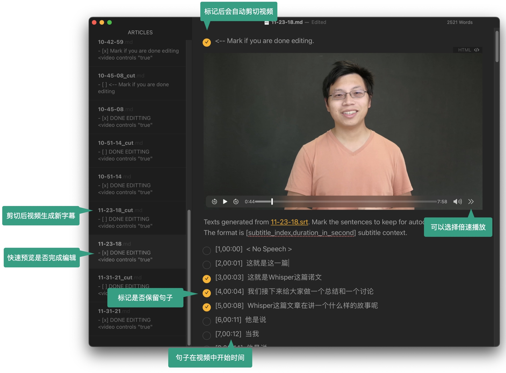

# AutoCut: 通过字幕来剪切视频

AutoCut对你的视频自动生成字幕。然后你选择需要保留的句子，AutoCut将对你视频中对应的片段裁切并保存。你无需使用视频编辑软件，只需要编辑文本文件即可完成剪切。

## 使用例子

假如你录制的视频放在 `2022-11-04/` 这个文件夹里。那么运行

```bash
autocut -d 2022-11-04
```

> 提示：如果你使用OBS录屏，可以在 `设置->高级->录像->文件名格式` 中将空格改成`/`，既 `%CCYY-%MM-%DD/%hh-%mm-%ss`。那么视频文件将放在日期命名的文件夹里。

AutoCut将持续对这个文件夹里视频进行字幕抽取和剪切。例如，你刚完成一个视频录制，保存在 `11-28-18.mp4`。AutoCut将生成 `11-28-18.md`。你在里面选择需要保留的句子后，AutoCut将剪切出 `11-28-18_cut.mp4`，并生成 `11-28-18_cut.md` 来预览结果。

你可以使用任何的Markdown编辑器。例如我常用VS Code和Typora。下图是通过Typora来对 `11-28-18.md` 编辑。



全部完成后在 `autocut.md` 里选择需要拼接的视频后，AutoCut将输出 `autocut_merged.mp4` 和对应的字幕文件。

## 安装

首先安装 Python 包

```
pip install git+https://github.com/mli/autocut.git
```

> 上面将安装 [pytorch](https://pytorch.org/)。如果你需要GPU运行，且默认安装的版本不匹配的话，你可以先安装Pytorch。

另外需要安装 [ffmpeg](https://ffmpeg.org/)

```
# on Ubuntu or Debian
sudo apt update && sudo apt install ffmpeg

# on Arch Linux
sudo pacman -S ffmpeg

# on MacOS using Homebrew (https://brew.sh/)
brew install ffmpeg

# on Windows using Scoop (https://scoop.sh/)
scoop install ffmpeg
```

## 更多使用选项

TODO